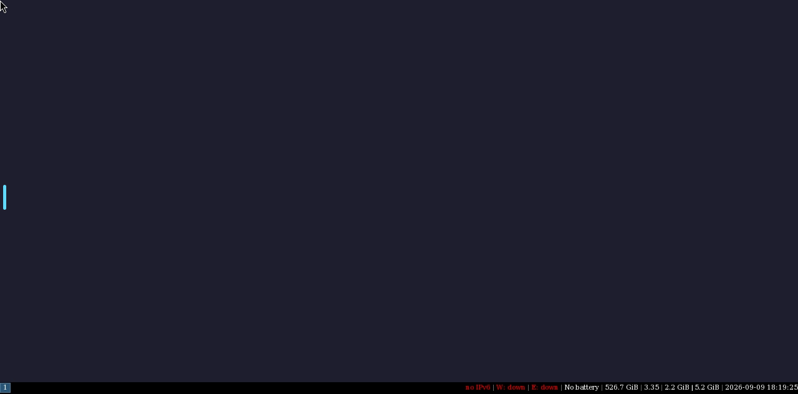
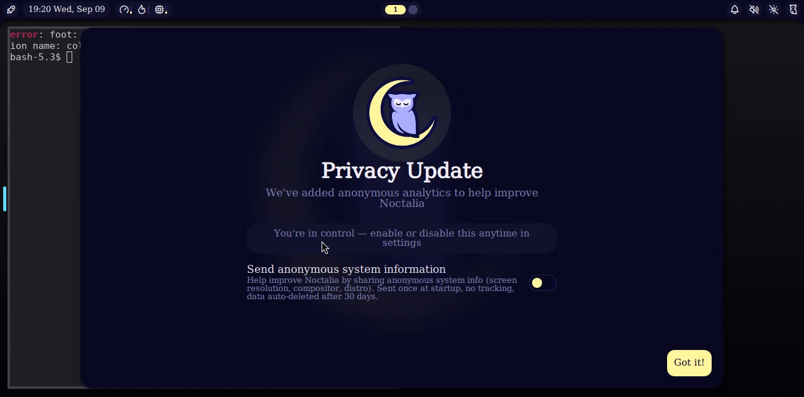

# nixos-webtop

A Nix flake that builds Docker images equivalent to
[linuxserver/docker-baseimage-selkies](https://github.com/linuxserver/docker-baseimage-selkies)
and [linuxserver/docker-webtop `arch-i3`](https://github.com/linuxserver/docker-webtop/blob/arch-i3/Dockerfile),
with every binary coming from nixpkgs instead of pacman/apt.

Open `http://localhost:3000` and you get a full Linux desktop (i3 + xfce4-terminal + Chromium)
streamed by [Selkies](https://github.com/selkies-project/selkies) over WebSockets.





## Images

| flake output       | what it is                                                | linuxserver equivalent          |
|--------------------|-----------------------------------------------------------|---------------------------------|
| `image-base`       | Xvfb + openbox + st/xterm + Selkies + nginx + PulseAudio  | `baseimage-selkies`             |
| `image-webtop-i3`  | `image-base` + i3, i3status, dmenu, xfce4-terminal, Chromium | `webtop:arch-i3`             |
| `image-webtop-niri`| Wayland mode: niri + noctalia-shell, foot, Chromium (Wayland), nautilus, xwayland-satellite | no direct equivalent (closest: `webtop:arch-i3` with `PIXELFLUX_WAYLAND=true`/sway) |

Both are `dockerTools.buildLayeredImage` outputs for `x86_64-linux` and `aarch64-linux`.

## Build and run

You do not need Nix installed. `build.sh` runs the build in a `nixos/nix` container
matching your CPU and loads the result into Docker:

```sh
./build.sh                  # -> selkies-nix-webtop-i3:latest
./build.sh image-webtop-niri # -> selkies-nix-webtop-niri:latest
./build.sh image-base       # -> selkies-nix-base:latest

docker run -d --name webtop \
  -p 3000:3000 -p 3001:3001 \
  --shm-size=1g \
  -v webtop-config:/config \
  -e PUID=1000 -e PGID=1000 -e TITLE="Nix i3" \
  selkies-nix-webtop-i3:latest
```

With Nix on Linux: `nix build .#image-webtop-i3 && docker load < result`.

Ports: `3000` HTTP, `3001` HTTPS with a self-signed cert generated into `/config/ssl`.

## Environment variables

The runtime honours the same knobs as the linuxserver image where they make sense:

`PUID`, `PGID`, `TITLE`, `PASSWORD` (basic auth), `CUSTOM_USER`, `CUSTOM_PORT`, `CUSTOM_HTTPS_PORT`,
`CUSTOM_WS_PORT`, `SUBFOLDER`, `DASHBOARD` (`selkies-dashboard` or `selkies-dashboard-wish`),
`FILE_MANAGER_PATH`, `SELKIES_FILE_TRANSFERS`, `DISABLE_IPV6`, `SELKIES_MANUAL_WIDTH/HEIGHT`, `MAX_RES`,
`HARDEN_DESKTOP`, `DISABLE_SUDO`, `NO_GAMEPAD`, `LC_ALL`, plus any `SELKIES_*` setting
Selkies itself reads. Set `SKIP_CHOWN_CONFIG=true` to skip the recursive chown of `/config`.

Drop an executable `startwm.sh` in `/config/.config/` to replace the window manager launcher.

## How it maps to the linuxserver image

| linuxserver                          | here                                                        |
|--------------------------------------|-------------------------------------------------------------|
| s6-overlay `init-*` oneshots         | `rootfs/init` (bash, then `exec s6-svscan`)                  |
| s6-overlay `svc-*` longruns          | `rootfs/etc/s6/service/*/run`, supervised by `s6-svscan`     |
| `/defaults/*`                        | `rootfs/defaults/*` (nginx template, PulseAudio, dbus, WM)   |
| `pip install .` of selkies           | `nix/selkies.nix` (`buildPythonApplication`)                 |
| pixelflux/pcmflux from PyPI          | `nix/pixelflux.nix`, `nix/pcmflux.nix` (manylinux wheels + autoPatchelf) |
| npm builds of web-core + dashboards  | `nix/selkies-web.nix` (`buildNpmPackage`, lockfiles in `frontend/locks`) |
| js-interposer + fake-udev            | `nix/selkies-addons.nix`                                     |
| nginx + `nginx-mod-fancyindex` (AUR) | `nix/nginx.nix` (`nginxModules.fancyindex`)                  |
| `/usr/bin/chromium` wrapper          | `hiPrio writeShellScriptBin "chromium"` in `flake.nix`       |
| patched Xvfb (`-vfbdevice` DRI3)     | stock Xvfb from nixpkgs, software rendering only            |

Filesystem layout inside the container: `/usr/{bin,lib,share,etc}` are symlinks into a
`buildEnv` of all packages, so `PATH=/usr/bin` behaves like a normal distro. `/etc` holds
real files (passwd, group, sudoers, pam.d, fonts.conf) so `usermod`/`groupmod` can edit them
at start for `PUID`/`PGID`. `sudo` is copied to `/usr/local/bin` and made setuid in
`fakeRootCommands`.

## Adding your own webtop flavour

In `flake.nix`, call `mkSelkiesImage` with a different `startwm` script and package list:

```nix
image-webtop-xfce = self.mkSelkiesImage {
  name = "selkies-nix-webtop-xfce";
  title = "Nix XFCE";
  startwm = ./rootfs/defaults/startwm-xfce.sh;   # exec startxfce4
  extraPackages = with final; [ xfce.xfce4-session xfce.xfce4-panel xfce.xfdesktop xfce.thunar firefox ];
};
```

## Updating pins

- Selkies commit and hashes: `selkiesSrc` in `flake.nix`, `nix/python-xlib-selkies.nix`.
- pixelflux/pcmflux wheels: the tables in `nix/pixelflux.nix` and `nix/pcmflux.nix`
  (add a row for the Python version nixpkgs ships; hashes from `pip download` or PyPI).
- Frontend: regenerate `frontend/locks/*.package-lock.json` with
  `npm install --package-lock-only` in each `addons/*` directory, then
  `nix run nixpkgs#prefetch-npm-deps -- <lockfile>` for the new `npmDepsHash`.

## Wayland mode (niri image)

`mkSelkiesImage { wayland = true; ... }` sets `PIXELFLUX_WAYLAND=true`. Selkies then starts
pixelflux's built-in Smithay compositor on `wayland-1` instead of Xvfb being captured, and the
`de` service waits for that socket and runs `startwm.sh` with `WAYLAND_DISPLAY=wayland-1`.
niri detects the parent compositor and runs nested via its winit backend; noctalia-shell is
started from niri's config (`spawn-at-startup`). The seeded config lives in
`rootfs/config/niri/config.kdl` and is copied to `/config/.config/niri/` on first run only.

Keys: `Mod+T` foot, `Mod+D` noctalia launcher, `Mod+B` Chromium, `Mod+E` nautilus,
`Mod+Shift+/` hotkey overlay. `Mod` is Super in niri; in a browser that usually needs the
Selkies sidebar's keyboard-lock toggle or remapping to avoid the host grabbing the key.

## Not ported (yet)

- linuxserver's labwc-based Wayland desktop (patched labwc/wlroots, selkies-desktop).
- Docker-in-Docker (`svc-docker`), proot-apps, pelorus accessibility bridge.
- GPU acceleration: no DRI3 Xvfb patch, no NVIDIA ICD shims. `/dev/dri` permission handling is kept
  so pixelflux can still pick a render node if you pass one in.
